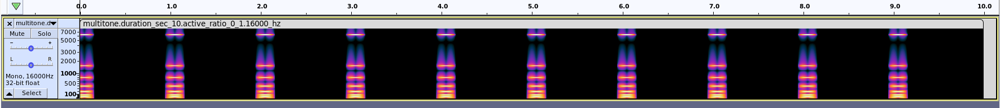

# atools: A set of audio tools

## 1. findecho.py

This tool will play a short sample and record simultanously looking for the first duplication of the played audio.
Typical use case is to record roundtrip delay on a single device or end to end delay in a communication system between devices.
The audio directory contains a 8kHz chirop which can be used as a signal.

```
$ python/findecho.py --help
usage: findecho.py [-h] -i IMPULSE -o OUTPUT_CSV [-t SECONDS] [-d DELAY]
                   [-s SAVE] [-v]

optional arguments:
  -h, --help            show this help message and exit
  -i IMPULSE, --impulse IMPULSE
  -o OUTPUT_CSV, --output_csv OUTPUT_CSV
  -t SECONDS, --seconds SECONDS
  -d DELAY, --delay DELAY
  -s SAVE, --save SAVE
  -v, --verbose
```


Example:

```
$ python/findecho.py -i audio/chirp_300-3k.wav -o pixel3 -t 30
```


## 2. multitone.py

This tool generates multitone wav files. A multitone is a series of (synchronized) sin signals at consecutive octaves, followed by silence. Tool allows selecting the first and last frequencies, the scale (to get louder/softer signals), the total duration, and the duration of the active part (the multitone concatenates periods of sin signal followed by silences).

Example:

```
$ ./python/multitone.py --duration-sec 10 --active-ratio 0.1 \
    multitone.duration_sec_10.active_ratio_0_1.16000_hz.wav
```



Figure 1 shows a (audacity) spectogram of the output file of the last command (available [here](audio/multitone.duration_sec_10.active_ratio_0_1.16000_hz.wav)).


Usage:
```
$ ./multitone.py --help
usage: multitone.py [-h] [-d] [--quiet] [--samplerate SAMPLERATE]
                    [--duration-sec DURATION_SEC]
                    [--active-ratio ACTIVE-RATIO] [--f0 F0] [--f1 F1]
                    [--scale SCALE] [--signal [multitone]]
                    output-file

positional arguments:
  output-file           output file

options:
  -h, --help            show this help message and exit
  -d, --debug           Increase verbosity (use multiple times for more)
  --quiet               Zero verbosity
  --samplerate SAMPLERATE
                        use SAMPLERATE samplerate
  --duration-sec DURATION_SEC
                        use DURATION_SEC duration_sec
  --active-ratio ACTIVE-RATIO
                        use active_ratio
  --f0 F0               use F0 for start chirp frequency
  --f1 F1               use F1 for end chirp frequency
  --scale SCALE         use scale
  --signal [multitone]  signal arg
```
